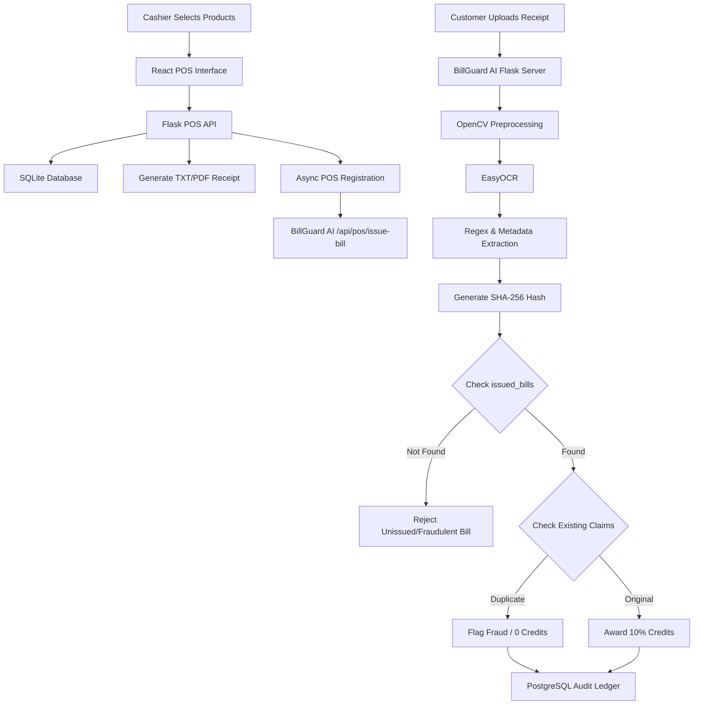
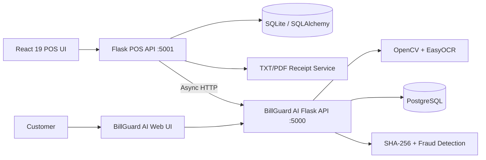
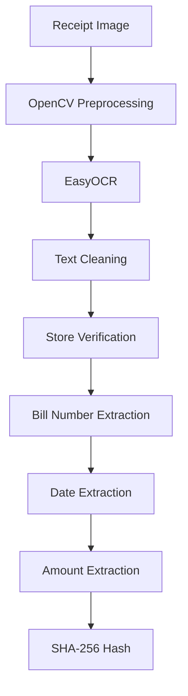
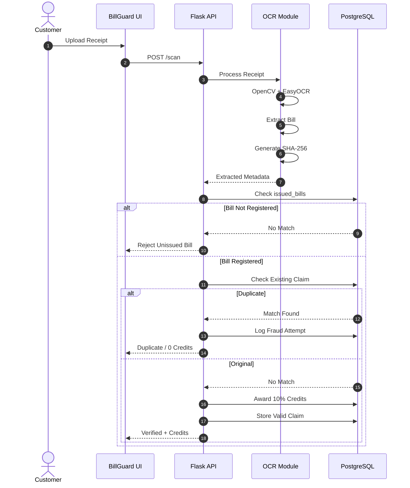
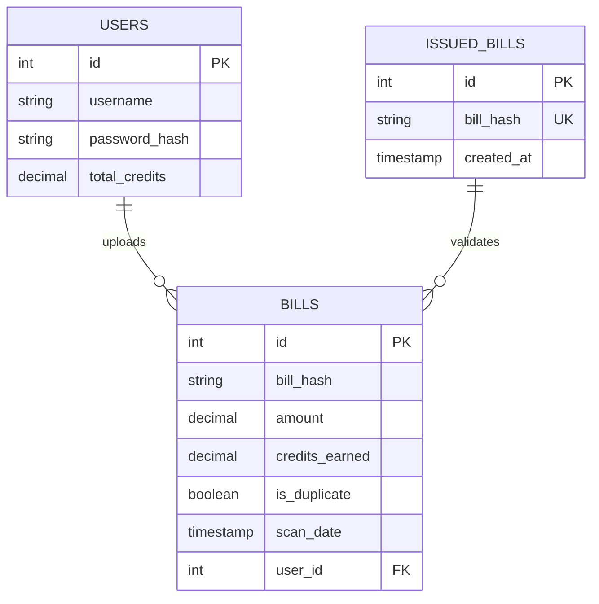

# 🛒🛡️ Smart Supermarket Billing, BillGuard AI & Fraud Detection Platform

An integrated supermarket ecosystem combining the **ABC Supermarket Point of Sale (POS) & Billing System** with **BillGuard AI**, an OCR-powered receipt verification, fraud detection, and customer credit reward platform.

The POS system handles product management, inventory, checkout, receipt generation, billing analytics, and transaction management. After checkout, bill metadata is asynchronously registered with BillGuard AI. BillGuard AI verifies uploaded receipt images using computer vision, OCR, POS-origin validation, and SHA-256 hashing to detect duplicate or fraudulent claims.

---

## 📌 Table of Contents

- [System Overview](#-system-overview)
- [Key Features](#-key-features)
- [Complete End-to-End Workflow](#-complete-end-to-end-workflow)
- [System Architecture](#-system-architecture)
- [Tech Stack](#-tech-stack)
- [POS Billing System](#-pos-billing-system)
- [BillGuard AI](#-billguard-ai)
- [Database Architecture](#-database-architecture)
- [API Endpoints](#-api-endpoints)
- [BillGuard AI Integration](#-billguard-ai-integration)
- [Evaluation & Testing](#-evaluation--testing)
- [Installation & Setup](#-installation--setup)
- [Default Credentials](#-default-credentials)
- [Project Directory Structure](#-project-directory-structure)

---

# 🚀 System Overview

This project consists of two integrated applications.

### 1. ABC Supermarket POS & Billing System

Provides:

- Product catalog management
- Inventory management
- Cashier billing
- Cart and checkout processing
- Cash/Card/UPI payments
- Automatic change calculation
- TXT and PDF receipt generation
- Bill history
- Sales analytics
- Administrative access controls
- Automated communication with BillGuard AI

### 2. BillGuard AI

Provides:

- Receipt image upload
- OpenCV preprocessing
- EasyOCR text extraction
- Receipt metadata parsing
- POS-issued bill verification
- SHA-256 receipt fingerprinting
- Duplicate bill detection
- Fraud attempt logging
- Customer credit allocation
- Administrative fraud analytics

Together, these components create a complete **transaction → receipt → verification → fraud detection → reward** pipeline.

---

# ✨ Key Features

## 🧾 POS Billing Terminal

- Auto-generated 10-digit sequential bill IDs.
- Live product search and cart management.
- Real-time stock validation.
- Automatic subtotal and total calculation.
- Cash, Card, and UPI payment support.
- Automatic change calculation.
- TXT and PDF receipt generation.
- Bill history and transaction lookup.

## 📦 Inventory Management

- Add products.
- Edit product details.
- Update stock.
- Soft-deactivate products.
- Low-stock warnings.
- Price and inventory synchronization.

## 📊 Sales Analytics

- Total revenue.
- Total bills.
- Average bill value.
- Date-range filtering.
- Payment method breakdown.
- Historical bill retrieval.

## 🔍 OCR Receipt Processing

BillGuard AI uses OpenCV and EasyOCR to process uploaded receipts.

The system:

1. Converts receipt images to grayscale.
2. Performs OCR using EasyOCR.
3. Cleans OCR output.
4. Removes camera/system timestamp noise.
5. Extracts bill number, date, and total amount.
6. Validates the supermarket identity.
7. Generates a SHA-256 fingerprint.

## 🚨 Fraud Detection

The platform performs multiple validation layers:

- POS-issued bill verification.
- SHA-256 receipt fingerprinting.
- Duplicate claim detection.
- Fraud attempt logging.
- Rejection of unregistered bills.

## 💳 Customer Credit Rewards

For a valid original receipt:

> **Reward Credits = Bill Amount × 10%**

Duplicate or fraudulent submissions receive **0 credits** and are logged as fraudulent attempts.

## 🔐 Security

- Administrative authentication.
- Password hashing using `scrypt`.
- SHA-256 receipt fingerprints.
- POS origin validation.
- Duplicate submission prevention.
- Audit logging.

---

# 🔄 Complete End-to-End Workflow



---

# 🏗️ System Architecture

The project uses two independent backend services connected through an API.



### Service Responsibilities

| Component | Responsibility |
|---|---|
| React POS UI | Cashier interaction and billing interface |
| Flask POS API | Billing, inventory, analytics and transactions |
| SQLite | POS transactional database |
| Receipt Service | TXT/PDF receipt generation |
| BillGuard AI API | Receipt verification and fraud detection |
| OpenCV | Receipt image preprocessing |
| EasyOCR | Text extraction |
| PostgreSQL | Verification and audit ledger |
| SHA-256 | Receipt fingerprinting |

---

# 🛠️ Tech Stack

## POS System

| Category | Technology | Purpose |
|---|---|---|
| Language | Python 3.x | Backend development |
| Backend | Flask | REST API and business logic |
| ORM | SQLAlchemy 2.0 | Database interaction |
| Database | SQLite | POS transaction storage |
| Frontend | React 19 | POS user interface |
| Build Tool | Vite 8 | React development/build |
| Styling | Vanilla CSS | Responsive glassmorphism UI |
| Icons | Lucide React | UI icons |
| PDF | ReportLab | PDF receipt generation |
| Testing | Pytest | Automated testing |
| CORS | Flask-CORS | Frontend/backend communication |

## BillGuard AI

| Category | Technology | Purpose |
|---|---|---|
| Language | Python 3.8+ | Backend |
| Backend | Flask 3.0+ | REST endpoints and application logic |
| Computer Vision | OpenCV | Image preprocessing |
| OCR | EasyOCR | Receipt text extraction |
| Database | PostgreSQL | Verification and audit ledger |
| Driver | psycopg2-binary | PostgreSQL connectivity |
| Authentication | Flask-Login / Werkzeug | Sessions and password hashing |
| Cryptography | hashlib / SHA-256 | Receipt fingerprinting |
| Parsing | Regex | Receipt metadata extraction |
| Frontend | HTML/CSS/JavaScript | User and admin interfaces |

---

# 🧾 POS Billing System

## End-to-End Checkout

1. Cashier searches for products.
2. Products are added to the cart.
3. The system checks stock availability.
4. Cashier selects a payment method.
5. Payment amount is validated.
6. Inventory is atomically updated.
7. Bill transaction is stored.
8. TXT/PDF receipt is generated.
9. Bill metadata is sent asynchronously to BillGuard AI.
10. BillGuard AI registers the receipt in its official POS ledger.

### Supported Payment Methods

- Cash
- Card
- UPI

---

# 🛡️ BillGuard AI

## OCR Pipeline



### Metadata Extraction

BillGuard AI extracts:

- Store name
- Bill number
- Purchase date
- Total amount

The system validates the expected supermarket header and standardizes supported date formats.

## Fraud Verification Pipeline



---

# 🗄️ Database Architecture

The project uses two databases for different responsibilities:

- **SQLite + SQLAlchemy** → POS transactional operations.
- **PostgreSQL** → BillGuard AI verification, user credits, and fraud/audit records.

## POS Database

### `products`

| Column | Type | Description |
|---|---|---|
| `id` | Integer | Primary key |
| `name` | String(100) | Product name |
| `price` | Numeric(10,2) | Product price |
| `stock` | Integer | Available stock |
| `is_active` | Boolean | Product status |
| `created_at` | DateTime | Creation timestamp |
| `updated_at` | DateTime | Last update |

### `bills`

| Column | Type | Description |
|---|---|---|
| `bill_no` | String(10) | Primary key |
| `bill_date` | Date | Transaction date |
| `bill_time` | Time | Transaction time |
| `total_amount` | Numeric(10,2) | Total bill |
| `paid_amount` | Numeric(10,2) | Amount paid |
| `change_amount` | Numeric(10,2) | Change returned |
| `payment_method` | String(20) | Cash/Card/UPI |

### `bill_items`

| Column | Type | Description |
|---|---|---|
| `id` | Integer | Primary key |
| `bill_no` | String(10) | Bill foreign key |
| `product_id` | Integer | Product foreign key |
| `quantity` | Integer | Purchased quantity |
| `unit_price` | Numeric(10,2) | Price at transaction |
| `subtotal` | Numeric(10,2) | Quantity × Unit price |

## BillGuard AI Database

### `users`

Stores user identities, password hashes, and total credit balance.

### `bills`

Stores every receipt claim, including valid and fraudulent submissions.

### `issued_bills`

Stores official bill metadata registered by the POS system.



---

# 📡 API Endpoints

## POS Product APIs

| Method | Endpoint | Purpose |
|---|---|---|
| GET | `/api/products` | Retrieve products |
| GET | `/api/products/low-stock` | Retrieve low-stock products |
| POST | `/api/products` | Add product |
| PUT | `/api/products/<id>` | Update product |
| DELETE | `/api/products/<id>` | Soft-deactivate product |

## POS Billing APIs

| Method | Endpoint | Purpose |
|---|---|---|
| GET | `/api/bill/next-number` | Get next bill number |
| POST | `/api/bill/checkout` | Process checkout |
| GET | `/api/bills` | Retrieve bill history |
| GET | `/api/bills/<bill_no>` | Retrieve bill details |
| GET | `/api/bills/<bill_no>/receipt` | Download receipt |
| GET | `/api/analytics` | Retrieve sales analytics |

## BillGuard AI POS Integration

### `POST /api/pos/issue-bill`

Registers a legitimate POS-generated bill.

Example payload:

```json
{
  "bill_number": "1000000001",
  "date": "14/08/2026"
}
```

Successful response:

```json
{
  "status": "success",
  "message": "Bill registered in ledger."
}
```

The POS application sends this request asynchronously so the cashier checkout process does not wait for downstream BillGuard verification.

---

# 📊 Evaluation & Testing

## BillGuard AI Metrics

The BillGuard AI documentation reports:

| Metric | Target | Measured Result |
|---|---:|---:|
| OCR Text Extraction Precision | >90% | 96.4% |
| OCR Text Extraction Recall | >90% | 94.2% |
| Fraud Hash Collision Accuracy | 100% | 100% |
| Un-issued Bill Block Rate | 100% | 100% |
| Average End-to-End Latency | <3 sec | 1.85 sec |
| Database Query Overhead | <50 ms | 4.2 ms |

## POS Testing

Automated Pytest coverage includes:

1. Stock deduction accuracy.
2. Subtotal and total calculation.
3. Change calculation.
4. Insufficient payment handling.
5. Inventory quantity validation.
6. Sequential 10-digit bill number generation.

### Run Tests

```bash
pytest
```

## Manual Integration Tests

### 1. POS Registration Test

Send a request to:

```text
POST /api/pos/issue-bill
```

with a valid bill number and date.

### 2. Original Receipt Test

1. Register a bill through POS.
2. Log in as a customer.
3. Upload a matching receipt.
4. Verify that the receipt is accepted.
5. Verify that 10% credits are awarded.

### 3. Duplicate Receipt Test

1. Upload the same receipt again.
2. Verify SHA-256 duplication detection.
3. Confirm 0 credits.
4. Confirm the fraud attempt is logged.

### 4. Un-issued Bill Test

Upload a receipt whose bill was never registered by the POS system.

Expected result:

> The receipt should be rejected as an unverified/unissued bill.

---

# 🚀 Installation & Setup

## Prerequisites

- Python 3.9+
- Node.js 18+
- npm
- PostgreSQL

## 1. POS Backend Setup

```bash
cd bill

python -m venv venv

# Windows
venv\Scripts\activate

# Linux/macOS
source venv/bin/activate

pip install -r requirements.txt

python app_api.py
```

POS backend:

```text
http://localhost:5001
```

## 2. POS Frontend Setup

```bash
cd bill/web_ui

npm install

npm run dev
```

React frontend:

```text
http://localhost:5173
```

## 3. BillGuard AI Setup

```powershell
python -m venv venv
.\venv\Scripts\Activate.ps1
```

Install dependencies:

```bash
pip install -r requirements.txt
pip install psycopg2-binary
```

Create the PostgreSQL database:

```sql
CREATE DATABASE billguard;
```

Configure the database credentials in `app.py`:

```text
DB_USER
DB_PASS
DB_HOST
DB_NAME
```

Start the BillGuard AI server:

```bash
python app.py
```

BillGuard AI:

```text
http://127.0.0.1:5000/
```

---

# 🔑 Default Credentials

The BillGuard AI documentation specifies:

```text
Role: Platform Administrator
Username: admin
Password: admin123
Dashboard: http://127.0.0.1:5000/admin
```

For production deployment, replace default credentials and store secrets securely.

---

# 📂 Project Directory Structure

```text
supermarket-platform/
│
├── bill/
│   ├── app_api.py
│   ├── create_tables.py
│   ├── database.py
│   ├── models.py
│   ├── receipts/
│   ├── services/
│   │   ├── bill_history_service.py
│   │   ├── bill_number_service.py
│   │   ├── billing_service.py
│   │   ├── product_service.py
│   │   └── receipt_service.py
│   ├── tests/
│   │   ├── test_bill_number_service.py
│   │   ├── test_billing_service.py
│   │   └── test_product_service.py
│   └── web_ui/
│       ├── src/
│       │   ├── components/
│       │   ├── api.js
│       │   └── App.jsx
│       └── package.json
│
└── BillGuard AI/
    ├── app.py
    ├── ocr.py
    ├── README.md
    ├── BILLGUARD_AI_Project_Report.md
    ├── Accessing the databases.txt
    ├── requirements.txt
    ├── templates/
    │   ├── index.html
    │   ├── admin.html
    │   ├── login.html
    │   └── register.html
    ├── static/
    │   ├── main.js
    │   └── style.css
    ├── data/
    ├── uploads/
    └── venv/
```

---

# 🔗 Integration Summary

```text
Customer Purchase
       │
       ▼
┌──────────────────────┐
│ ABC Supermarket POS  │
│ React + Flask        │
└──────────┬───────────┘
           │
           ├── Inventory Update
           ├── Bill Transaction
           └── TXT/PDF Receipt
                    │
                    ▼
           Async POS Registration
                    │
                    ▼
┌──────────────────────────┐
│      BillGuard AI        │
│ Flask + EasyOCR + OpenCV │
└────────────┬─────────────┘
             │
             ├── OCR Extraction
             ├── Store Validation
             ├── Bill Validation
             ├── SHA-256 Hashing
             └── Duplicate Detection
                     │
          ┌──────────┴──────────┐
          ▼                     ▼
      Original                Duplicate
          │                     │
          ▼                     ▼
    +10% Credits          Fraud / 0 Credits
```

---

# 🎯 Project Objective

The combined platform demonstrates the integration of:

- Full-stack web development
- REST APIs
- Inventory and transaction management
- Computer vision
- OCR
- Cryptography
- Relational databases
- Fraud detection
- Automated testing
- Asynchronous service integration

The POS system acts as the source of truth for legitimate supermarket transactions, while BillGuard AI provides an additional verification layer for uploaded receipts and customer reward claims.

---

## 👨‍💻 Project Highlights

- Full-stack supermarket POS system.
- React 19 + Flask architecture.
- Inventory and transaction management.
- Automated receipt generation.
- Computer vision and OCR.
- SHA-256 receipt verification.
- POS-to-fraud-engine API integration.
- Duplicate and unissued bill detection.
- Customer credit reward mechanism.
- PostgreSQL audit ledger.
- SQLite transactional POS database.
- Automated Pytest testing.
- RESTful API architecture.

---

*Integrated supermarket billing and receipt verification platform combining transactional POS infrastructure with AI-powered OCR and fraud detection.*
