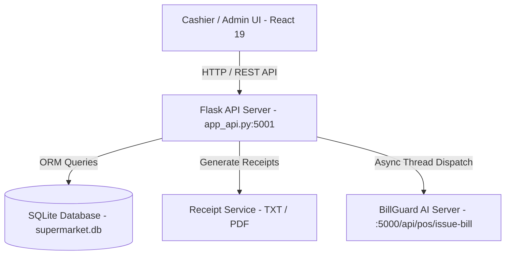

# 🛒 ABC Supermarket Point of Sale (POS) & Billing System

A modern, high-performance, and secure Point of Sale (POS) billing system built with Python Flask, SQLAlchemy, SQLite, and React 19 (Vite). Designed for supermarket environments, it features real-time inventory management, transactional receipt generation (TXT & PDF), analytics, admin access controls, and asynchronous integration with **BillGuard AI** for receipt verification.

---

## 📌 Table of Contents
- [Tech Stack](#-tech-stack)
- [System Architecture & Data Flow](#-system-architecture--data-flow)
- [Key Features](#-key-features)
- [Database Schema](#-database-schema)
- [API Endpoints](#-api-endpoints)
- [BillGuard AI Integration](#-billguard-ai-integration)
- [Testing & Evaluation Metrics](#-testing--evaluation-metrics)
- [Getting Started & Installation](#-getting-started--installation)
- [Project Directory Structure](#-project-directory-structure)

---

## 🛠 Tech Stack

### Backend
- **Language**: Python 3.x
- **Framework**: Flask (RESTful API), Flask-CORS
- **Database & ORM**: SQLite (`supermarket.db`), SQLAlchemy 2.0 (Mapped Types)
- **PDF Generation**: ReportLab
- **Testing**: Pytest

### Frontend
- **Framework**: React 19, Vite 8
- **Icons**: Lucide React
- **Styling**: Vanilla CSS (Custom tokens, glassmorphism, responsive grid layout)

---

## 🔄 System Architecture & Data Flow



### End-to-End Workflow:
1. **Product Selection & Cart**: The Cashier searches or selects items from the product catalog. The system dynamically updates line items, checks real-time stock levels, and calculates subtotal and totals.
2. **Checkout Processing**:
   - The cashier enters the payment amount and payment method (Cash, Card, UPI).
   - Flask API validates sufficient stock and adequate payment amount.
   - Atomically updates inventory stock levels in SQLite and records the bill transaction.
3. **Receipt & Security Broadcasting**:
   - Formatted `.txt` and styled `.pdf` receipts are generated on disk.
   - A background thread non-blockingly dispatches bill details (`bill_number`, `date`) to **BillGuard AI** for automated OCR receipt protection and anti-fraud validation.

---

## ✨ Key Features

- 🧾 **POS Billing Terminal**:
  - Auto-generated 10-digit sequential bill IDs.
  - Live product search & quick cart addition.
  - Automatic change calculation & stock reservation.
  - One-click print/download receipts (.txt & ReportLab PDF).

- 📦 **Inventory Management (Admin)**:
  - Add, edit, or soft-deactivate products.
  - Low-stock warning indicators (configurable threshold).
  - Price & stock synchronization.

- 📊 **Bill History & Sales Analytics (Admin)**:
  - Historical bill retrieval with date-range filters.
  - Revenue summary (Total Revenue, Total Bills, Average Bill Value).
  - Payment method breakdown (Cash vs. Card vs. UPI).

- 🔐 **Security**:
  - Modal-based PIN authentication for administrative actions (Inventory & Analytics access).
  - Asynchronous event hook to BillGuard AI.

---

## 🗄 Database Schema

The SQLite database (`supermarket.db`) utilizes SQLAlchemy 2.0 ORM:

### 1. `products`
| Column | Type | Constraints / Details |
|---|---|---|
| `id` | Integer | Primary Key, Auto-increment |
| `name` | String(100) | Not Null |
| `price` | Numeric(10,2)| Not Null |
| `stock` | Integer | Default 0 |
| `is_active` | Boolean | Default True, Indexed |
| `created_at` | DateTime | Timestamp |
| `updated_at` | DateTime | Timestamp |

### 2. `bills`
| Column | Type | Constraints / Details |
|---|---|---|
| `bill_no` | String(10) | Primary Key (10-digit formatted) |
| `bill_date` | Date | Not Null, Indexed |
| `bill_time` | Time | Not Null |
| `total_amount` | Numeric(10,2)| Total bill amount |
| `paid_amount` | Numeric(10,2)| Amount tendered |
| `change_amount` | Numeric(10,2)| Change returned |
| `payment_method` | String(20) | Cash / Card / UPI |

### 3. `bill_items`
| Column | Type | Constraints / Details |
|---|---|---|
| `id` | Integer | Primary Key, Auto-increment |
| `bill_no` | String(10) | Foreign Key (`bills.bill_no`) |
| `product_id` | Integer | Foreign Key (`products.id`) |
| `quantity` | Integer | Quantity purchased |
| `unit_price` | Numeric(10,2)| Unit price at time of sale |
| `subtotal` | Numeric(10,2)| Quantity × Unit Price |

---

## 📡 API Endpoints

### Product Management
- `GET /api/products` - Retrieve list of products (Query params: `search`, `include_inactive`)
- `GET /api/products/low-stock` - Retrieve products below stock threshold
- `POST /api/products` - Add a new product
- `PUT /api/products/<id>` - Update product details/stock
- `DELETE /api/products/<id>` - Soft deactivate product

### Billing & Transactions
- `GET /api/bill/next-number` - Get next sequential 10-digit bill number
- `POST /api/bill/checkout` - Execute checkout, deduct inventory, generate receipt, trigger BillGuard AI dispatch
- `GET /api/bills` - Query bill history (Query params: `start_date`, `end_date`)
- `GET /api/bills/<bill_no>` - Get specific bill details with line items
- `GET /api/bills/<bill_no>/receipt` - Download formatted receipt (`format=txt` or `format=pdf`)
- `GET /api/analytics` - Get financial statistics & metrics

---

## 🛡 BillGuard AI Integration

When a checkout transaction completes, the system asynchronously sends the POS metadata to the **BillGuard AI Engine** via a non-blocking background thread:

```json
{
  "bill_number": "1000000001",
  "date": "14/08/2026"
}
```

This architecture ensures zero latency for the cashier terminal while maintaining receipt authenticity verification downstream.

---

## 🧪 Testing & Evaluation Metrics

The system includes automated test suites using `pytest` to guarantee reliability:

### Key Test Metrics Covered:
1. **Stock Deduction Accuracy**: Verifies inventory is decremented by exact item quantities upon checkout.
2. **Financial Validation**:
   - Correct subtotal and total calculation.
   - Exact change calculation (`paid_amount - total_amount`).
   - Exception handling for insufficient payment (`paid_amount < total_amount`).
3. **Inventory Safeguards**: Raises errors if cart quantity exceeds available stock.
4. **Bill Number Formatting & Sequentiality**: Validates 10-digit zero-padded bill number generation.

### Run Tests:
```bash
# From the bill directory
pytest
```

---

## 🚀 Getting Started & Installation

### Prerequisites
- Python 3.9+
- Node.js 18+ & npm

### 1. Backend Setup
```bash
cd bill
python -m venv venv
# On Windows:
venv\Scripts\activate
# On Linux/macOS:
source venv/bin/activate

pip install -r requirements.txt
python app_api.py
```
*The backend API server will start on `http://localhost:5001`.*

### 2. Frontend Setup
```bash
cd bill/web_ui
npm install
npm run dev
```
*The React frontend dev server will launch on `http://localhost:5173`.*

---

## 📂 Project Directory Structure

```
bill/
├── app_api.py               # Flask Web REST API Server & Routing
├── create_tables.py         # DB Initializer
├── database.py             # SQLAlchemy Engine & Session Setup
├── models.py               # Database ORM Schemas (Product, Bill, BillItem)
├── receipts/               # Auto-generated TXT & PDF receipt documents
├── services/
│   ├── bill_history_service.py # Analytics & Search Service
│   ├── bill_number_service.py  # 10-digit Bill Number Generator
│   ├── billing_service.py       # Transactional Checkout Engine
│   ├── product_service.py       # Inventory CRUD Operations
│   └── receipt_service.py       # TXT & ReportLab PDF Generator
├── tests/                  # Pytest Unit & Integration Test Suite
│   ├── test_bill_number_service.py
│   ├── test_billing_service.py
│   └── test_product_service.py
└── web_ui/                 # React 19 Frontend Application
    ├── src/
    │   ├── components/     # POS Billing, Inventory, History, Navbar, Admin Modal
    │   ├── api.js          # REST Client Functions
    │   └── App.jsx         # Root React Component
    └── package.json
```
