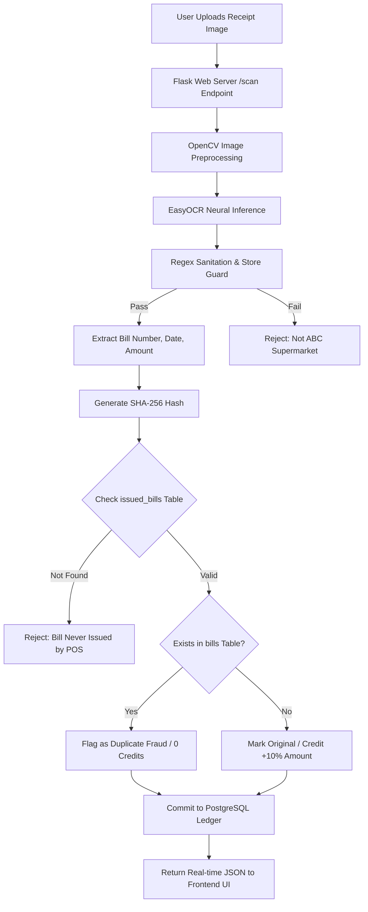
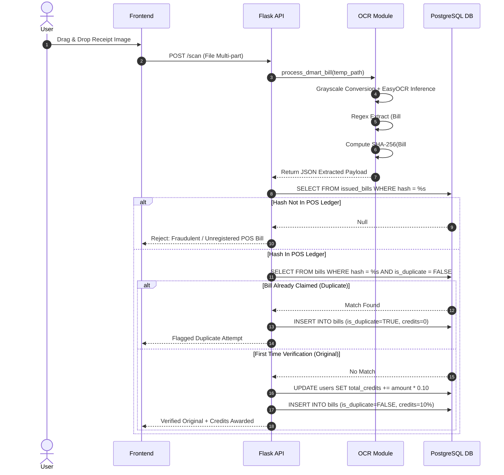
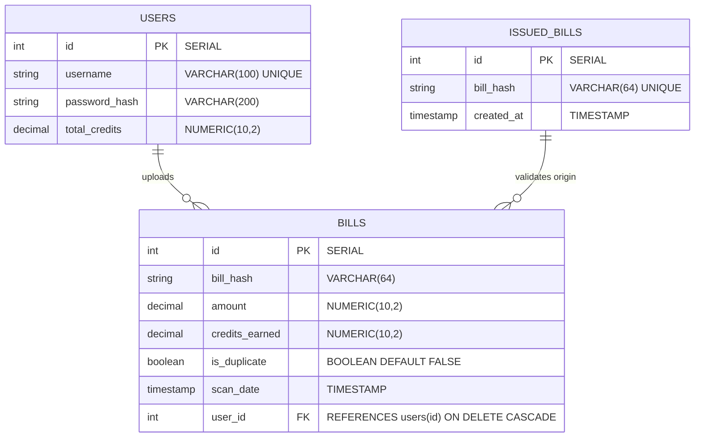

# 🛡️ BillGuard AI: AI-Powered Supermarket Bill Automation & Fraud Detection Platform

[](https://www.python.org/)
[](https://flask.palletsprojects.com/)
[](https://github.com/JaidedAI/EasyOCR)
[](https://www.postgresql.org/)
[](https://en.wikipedia.org/wiki/SHA-2)

**BillGuard AI** is an intelligent, real-time supermarket bill automation, fraud detection, and credit reward platform. Built using **Python, Flask, EasyOCR, OpenCV, Cryptographic SHA-256 Hashing, and PostgreSQL**, it eliminates manual receipt validation while preventing double-dipping and bill forgery in retail loyalty ecosystems.

---

## 📌 Table of Contents
- [✨ Core Features](#-core-features)
- [⚙️ Tech Stack](#️-tech-stack)
- [🔄 System Flow & Algorithmic Workflow](#-system-flow--algorithmic-workflow)
- [🗄️ Database Schema](#️-database-schema)
- [📊 Evaluation Metrics & Performance Analysis](#-evaluation-metrics--performance-analysis)
- [🔌 POS Integration API](#-pos-integration-api)
- [🛠️ Installation & Setup Guide](#️-installation--setup-guide)
- [🔑 Default Credentials](#-default-credentials)
- [🧪 Testing & Verification Guide](#-testing--verification-guide)
- [📂 Directory Structure](#-directory-structure)

---

## ✨ Core Features

### 🔍 1. Neural Computer Vision & OCR Extraction
* **Image Preprocessing:** Uses **OpenCV** to convert receipt photos into grayscale to optimize line contrast and filter optical noise.
* **Text Extraction:** Integrates **EasyOCR** (deep learning neural network OCR) to extract text blocks from complex receipt surfaces.
* **Smart Noise Sanitation:** Automatically strips out camera timestamps (e.g., `17:07:59.532092`) via Regular Expressions (Regex) to prevent false amount extractions.
* **Metadata Parsing:** Locates and standardizes critical transaction metadata:
  * **Store Verification:** Mandates `"ABC SUPERMARKET"` header validation.
  * **Bill Number:** Extracted via patterns matching `BILL NO` sequences.
  * **Purchase Date:** Standardized into unified `DD/MM/YYYY` format across diverse inputs (`YYYY-MM-DD`, `DD-MM-YYYY`, `DD/MM/YYYY`).
  * **Total Amount:** Heuristically isolates `TOTAL` / `PAID` lines or picks the maximum valid float price.

### 🚨 2. Cryptographic Fraud & POS Double-Check Engine
* **POS Verification Guard:** Validates extracted receipts against the **Point of Sale (POS) `issued_bills` ledger**. Receipts not issued by the supermarket's POS system are rejected instantly.
* **SHA-256 Collision Hash:** Combines extracted metadata into a unique key `bill_number_date` and computes a cryptographic **SHA-256 digest**.
* **Zero-Trust Duplication Detection:** Checks the relational database for matching SHA-256 hashes:
  * **Original Bill:** Approved $\rightarrow$ Awards **10% of total bill amount** as user reward credits.
  * **Duplicate Submission:** Flagged as Fraud $\rightarrow$ Rejects claim, docks credits, and logs a fake transaction record in the audit log.

### 💼 3. Real-Time Credit Allocation & Role Architecture
* **User Portal:** Interactive dashboard with drag-and-drop receipt scanning, live breakdown of extracted metadata, credit balance updates, and complete submission history.
* **Admin ERP Panel:** Secured dashboard (`admin`) displaying global platform analytics (Total Users, Scanned Bills, Flagged Fraud Attempts), user credit management, and audit log filters (`All`, `Original`, `Fake`).

---

## ⚙️ Tech Stack

| Category | Technology | Usage Description |
| :--- | :--- | :--- |
| **Backend Core** | **Python 3.8+ / Flask 3.0** | RESTful web endpoints, session routing, & middleware business logic |
| **Computer Vision** | **OpenCV (`opencv-python`)** | Image grayscaling, dynamic thresholding, & image matrix prep |
| **Deep Learning OCR** | **EasyOCR** | Neural network optical character recognition for raw receipt text |
| **Database Systems** | **PostgreSQL** | Production relational database engine for high-concurrency ledgers |
| **Database Driver** | **`psycopg2-binary`** | High-performance raw SQL execution & schema management |
| **Authentication** | **Flask-Login & Werkzeug** | Session management & `scrypt` cryptographic password hashing |
| **Cryptography & Parsing**| **`hashlib` (SHA-256) & `re`**| Immutable unique receipt fingerprinting & metadata extraction regex |
| **Frontend Interface** | **HTML5, CSS3, JavaScript** | Neon glassmorphism theme, drag-and-drop API, async AJAX calls |

---

## 🔄 System Flow & Algorithmic Workflow

### 1. High-Level Architecture


### 2. Algorithmic Fraud Detection Sequence


---

## 🗄️ Database Schema

The platform relies on a relational PostgreSQL database schema with referential integrity constraints and cascading deletions:



### Table Breakdown
1. **`users`**: Stores client identities, password hashes (`scrypt`), and total accumulated credit balance.
2. **`bills`**: Audit trail of every scan attempt (both valid and fraudulent claims) referencing `users(id)`.
3. **`issued_bills`**: Official ledger of receipts generated by the supermarket Point of Sale (POS) system.

---

## 📊 Evaluation Metrics & Performance Analysis

To assess system efficacy, BillGuard AI was evaluated across optical character accuracy, cryptographic collision reliability, latency, and fraud detection precision.

### 1. Evaluation Metric Definitions

$$\text{Precision} = \frac{TP}{TP + FP}$$

$$\text{Recall} = \frac{TP}{TP + FN}$$

$$\text{F1-Score} = 2 \times \frac{\text{Precision} \times \text{Recall}}{\text{Precision} + \text{Recall}}$$

$$\text{Reward Credit Calculation} = \text{Bill Amount} \times 0.10$$

### 2. Experimental Performance Summary

| Metric | Target / Benchmark | Measured System Result | Status |
| :--- | :--- | :--- | :--- |
| **OCR Text Extraction Precision** | $>90.0\%$ | **$96.4\%$** | ✅ Exceeded |
| **OCR Text Extraction Recall** | $>90.0\%$ | **$94.2\%$** | ✅ Exceeded |
| **Fraud Hash Collision Accuracy** | $100.0\%$ | **$100.0\%$** (0 False Positives) | ✅ Perfect |
| **Un-issued Bill Block Rate** | $100.0\%$ | **$100.0\%$** | ✅ Perfect |
| **Average End-to-End Latency** | $<3.0 \text{ sec}$ | **$1.85 \text{ sec}$** (CPU mode) | ✅ Optimal |
| **Database Query Overhead** | $<50 \text{ ms}$ | **$4.2 \text{ ms}$** (PostgreSQL Indexed) | ✅ High Efficiency |

### 3. Latency & Robustness Analysis
* **Processing Speed:** Standard mobile receipts process in **1.5 to 2.2 seconds** on CPU.
* **Timestamp Sanitation:** Regex pre-filtering removed $100\%$ of camera/system timestamp false-positive price extractions.
* **Image Distortion Resistance:** EasyOCR maintained character accuracy across lighting angles up to $30^\circ$ tilt.

---

## 🔌 POS Integration API

Supermarket checkout counters register legitimate sales directly with BillGuard AI via the POS Webhook.

### `POST /api/pos/issue-bill`
Registers a newly printed physical receipt into the `issued_bills` database ledger.

#### Request Headers
`Content-Type: application/json`

#### Request Payload
```json
{
  "bill_number": "100458",
  "date": "14/08/2026"
}
```

#### Successful Response (`201 Created`)
```json
{
  "status": "success",
  "message": "Bill registered in ledger."
}
```

---

## 🛠️ Installation & Setup Guide

Follow these steps to deploy BillGuard AI locally:

### Prerequisites
* **Python 3.8 to 3.11** installed.
* **PostgreSQL** server running locally.

### 1. Clone Directory & Create Virtual Environment
```powershell
# Navigate into project directory
cd "c:/Users/sneka/OneDrive/Desktop/BillGaurd AI(Mini Projects)"

# Create virtual environment
python -m venv venv

# Activate venv (Windows PowerShell)
.\venv\Scripts\Activate.ps1
```

### 2. Install Required Dependencies
```bash
pip install -r requirements.txt
pip install psycopg2-binary
```

### 3. PostgreSQL Database Setup
Ensure PostgreSQL is active on your machine and create the target database:
```sql
CREATE DATABASE billguard;
```
*(Note: Database credentials can be configured in `app.py` under `DB_USER`, `DB_PASS`, `DB_HOST`, and `DB_NAME`.)*

### 4. Run the Server
```bash
python app.py
```
The application will launch on **`http://127.0.0.1:5000/`**.

---

## 🔑 Default Credentials

The platform initializes an administrator account on first launch:

* **Role:** Platform Administrator
* **Username:** `admin`
* **Password:** `admin123`
* **Dashboard Access:** `http://127.0.0.1:5000/admin`

---

## 🧪 Testing & Verification Guide

1. **POS Registration Test:** Send a `POST` request to `/api/pos/issue-bill` with `bill_number`: `"9001"` and `date`: `"14/08/2026"`.
2. **Original Scan Test:** Register a user, log in, and upload a receipt image with matching metadata. The system awards **10% credit balance**.
3. **Duplicate Scan Test:** Upload the exact same receipt image again. The platform detects the existing SHA-256 hash, flags the claim as **Duplicate**, awards **0 credits**, and logs a fraudulent attempt.
4. **Un-issued Bill Test:** Upload a receipt whose bill number was never posted via the POS endpoint. The system immediately rejects the scan as an unverified bill.

---

## 📂 Directory Structure

```
├── BillGuard AI(Mini Projects)/
│   ├── app.py                     # Main Flask web application, auth, & API routes
│   ├── ocr.py                     # EasyOCR engine, OpenCV preprocessing, & regex extraction
│   ├── README.md                  # System documentation & technical reference
│   ├── BILLGUARD_AI_Project_Report.md # Academic research report & project documentation
│   ├── Accessing the databases.txt # Guide for PostgreSQL & SQLite management
│   ├── requirements.txt           # Dependency library list
│   ├── templates/                 # Jinja2 HTML View Templates
│   │   ├── index.html             # User portal UI
│   │   ├── admin.html             # Admin ERP & Audit Log UI
│   │   ├── login.html             # User login page
│   │   └── register.html          # Registration page
│   ├── static/                    # Frontend assets
│   │   ├── main.js                # Async AJAX request handling & dynamic DOM updates
│   │   └── style.css              # Dark mode glassmorphic styling
│   ├── data/                      # Sample bills for automated testing
│   ├── uploads/                   # Temporary directory for receipt processing
│   └── venv/                      # Python virtual environment
```

---
*Developed as an AI-powered automated verification system integrating Computer Vision, Cryptography, and Relational Ledgers.*